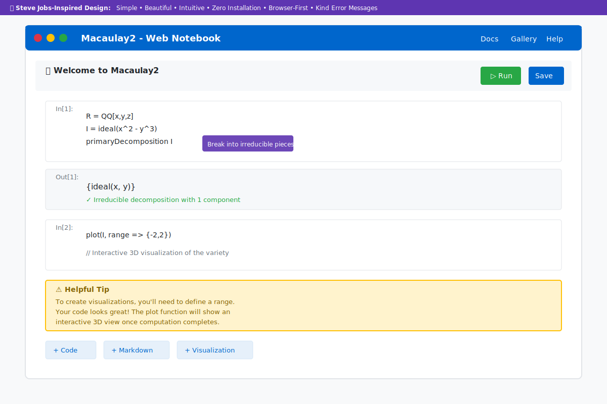

# Macaulay2 for Newbies
### Making Computational Algebra More Accessible

> "Simplicity is the ultimate sophistication."

## Vision

Build upon Macaulay2's powerful computational algebra capabilities with an intuitive, accessible interface that welcomes newcomers while preserving all the features that make it a world-class tool.

**The Goal:** Make computational algebraic geometry as approachable as opening a web browser, while maintaining the power that mathematicians rely on.

## Improved UI/UX Preview



*Our redesigned browser-based notebook interface: Simple, beautiful, and intuitive. Run Macaulay2 computations directly in your browser with zero installation required.*

## What's Inside

This repository contains comprehensive UI/UX design documentation for reimagining Macaulay2:

### 📘 [UI/UX Design Document](UI_UX_DESIGN.md)
Complete design specification covering:
- **Philosophy & Core Principles** - Design approach focused on simplicity
- **Enhancements & Solutions** - 8 areas of improvement with elegant solutions
- **User Journey Maps** - Day One, Week One, Month One experiences
- **Interface Specifications** - Detailed design for browser-first notebook
- **Documentation Structure** - Wikipedia-style, search-first approach
- **Error Message System** - Kind, educational, actionable feedback
- **Visualization Engine** - Beautiful mathematical rendering
- **Technical Implementation** - Architecture and technology stack
- **Success Metrics** - How we measure impact

### 🎯 [Design Principles](DESIGN_PRINCIPLES.md)
Quick reference guide with:
- **The Six Principles** - Core philosophy in action
- **Decision Framework** - How to evaluate features
- **Design Patterns** - Error messages, documentation, UI, onboarding
- **Anti-Patterns** - What NOT to do
- **Quick Examples** - Real decisions applying principles

### 🗺️ [Implementation Roadmap](ROADMAP.md)
40-week plan from prototype to public launch:
- **Phase 1: Foundation** (Weeks 1-12) - Functional MVP
- **Phase 2: Polish** (Weeks 13-24) - Production-ready interface
- **Phase 3: Scale** (Weeks 25-36) - Infrastructure & community
- **Phase 4: Ecosystem** (Weeks 37-40) - Advanced features
- **Resource Requirements** - Team, budget, timeline
- **Risk Management** - Identified risks and mitigation strategies
- **Success Metrics** - Measurable goals for each phase

## Opportunities for Enhancement

While Macaulay2 is a powerful and respected tool in computational algebra, we see opportunities to make it more welcoming to newcomers:

| Area | Enhancement Opportunity |
|------|------------------------|
| 🚀 Getting Started | Provide a browser-based option for instant access |
| 💻 Modern Interfaces | Offer Jupyter-style notebooks alongside traditional workflows |
| 🔍 Documentation | Add search-friendly, tutorial-focused resources |
| 💡 Error Messages | Make error messages more educational and actionable |
| 💬 Community Support | Supplement existing channels with real-time options |
| 📊 Visualization | Add interactive plotting and visual output options |
| 📝 Syntax Familiarity | Provide guides connecting M2 syntax to mathematical notation |

## Our Approach

Eight enhancements designed to welcome newcomers while preserving M2's power:

### 1. Easy Entry Points
- **Browser-based option**: Visit URL, start computing in seconds
- **Multiple installation paths** to suit different needs
- **Pre-filled examples** to get started quickly

### 2. Modern Interface Options
- **Jupyter-style notebook** as an alternative interface
- **LaTeX rendering** for beautiful mathematical output
- **Editor integrations** including VS Code support alongside existing options

### 3. Searchable Documentation
- **Wikipedia structure**: What → Why → Show → Try
- **Smart search** returns answers, not document lists
- **In-context help** without leaving workspace

### 4. Educational Error Messages
```
Enhanced messages that explain and guide:
"You haven't defined a ring yet. Try: R = QQ[x,y,z]"
```

### 5. Enhanced Support Channels
- **AI-powered assistant** in the interface
- **Active Discord** for real-time community help
- **Multiple support options** to complement existing resources

### 6. Beautiful Visualization
- **Interactive 3D plots** for varieties
- **Betti diagrams** as visual tables
- **LaTeX rendering** for publication-ready output

### 7. Syntax Guides
- **Documentation** connecting M2 syntax to mathematical notation
- **Convention guides** explaining design choices
- **Editor assistance** for common patterns

### 8. Simplified Installation
```bash
brew install macaulay2  # macOS
apt install macaulay2   # Ubuntu
# Or use the web version for instant access
```

## Design Philosophy

Six principles guide our enhancements:

1. **Simplicity first** - Provide sensible defaults that work most of the time
2. **Mathematics-focused** - Keep the focus on mathematical concepts, not technical details
3. **Goal-oriented** - Design for what mathematicians want to accomplish
4. **Helpful defaults** - Reduce configuration burden with good initial settings
5. **Attention to detail** - Polish typography, error messages, and interactions
6. **Iterative improvement** - Add features thoughtfully and incrementally

## User Journey

### Day One (5 minutes)
1. Visit macaulay2.org
2. Click "Start Computing"
3. Run pre-filled example: `R = QQ[x,y,z]; I = ideal(x^2 - y^3); primaryDecomposition I`
4. See beautiful LaTeX output
5. Feel: "I just did real mathematics!"

### Week One
- Complete interactive tutorials
- Solve first research problem
- Get help from AI assistant and Discord community
- Share notebook with colleagues

### Month One
- Use advanced features
- Write custom packages
- Install locally for heavy computation
- Contribute to community

## Success Metrics

### Quantitative
- Time to first computation: **< 2 minutes** (currently 30+ min)
- Tutorial completion: **> 75%**
- Error message helpfulness: **> 80%**
- Support ticket reduction: **50%**
- User retention (30-day): **> 40%**

### Qualitative
- "A welcoming way to learn computational algebra"
- "Clear explanations helped me understand"
- "Combines elegance with power"
- "Great for introducing students to M2"

### The Ultimate Goal
**Can a newcomer to M2 accomplish something meaningful in their first session and feel encouraged to continue?**

## Why This Matters

Macaulay2 is a powerful and respected tool in computational algebra, with unique capabilities valued by researchers worldwide. This project aims to:

1. **Broaden access** - Make M2 easier to discover and get started with
2. **Support learning** - Provide better resources for newcomers
3. **Grow the community** - Help more people experience M2's capabilities
4. **Preserve power** - Maintain all existing features while adding accessibility

**We believe M2's capabilities deserve to reach a wider audience.**

## Implementation Timeline

- **Months 1-3**: Foundation (web notebook, error messages, quickstart)
- **Months 4-6**: Polish (complete docs, visualization, community)
- **Months 7-9**: Scale (production infrastructure, local install)
- **Month 10**: Public launch

**Total:** 40 weeks from start to public launch

## Get Involved

This is a community effort. We welcome contributions in many forms:

1. **Feedback** - Review the design docs and share your thoughts
2. **User Testing** - Try prototypes and share your experience
3. **Development** - Help build the notebook, docs, or infrastructure
4. **Documentation** - Write tutorials, examples, or improve existing docs
5. **Community** - Answer questions, share notebooks, welcome newcomers

## Resources

- 📘 [Complete UI/UX Design](UI_UX_DESIGN.md) - Full specification
- 🎯 [Design Principles](DESIGN_PRINCIPLES.md) - Quick reference and decision framework
- 🗺️ [Implementation Roadmap](ROADMAP.md) - 40-week plan with milestones
- 🌐 [Macaulay2 Website](http://www2.macaulay2.com/) - The official M2 project
- 💬 Discord Community (planned - see roadmap)
- 🗨️ Discourse Forum (planned - see roadmap)

## Credits

**Design Philosophy:** Inspired by successful approaches to making powerful technology accessible through thoughtful design and simplicity.

**For the Community:** This project is by mathematicians, for mathematicians. Every decision serves one goal: **make computational algebra more welcoming for everyone**.

---

## Next Steps

1. **Read** the [UI/UX Design Document](UI_UX_DESIGN.md) for the complete vision
2. **Review** the [Design Principles](DESIGN_PRINCIPLES.md) for quick reference
3. **Study** the [Roadmap](ROADMAP.md) for implementation details
4. **Share** your feedback and ideas
5. **Join** the effort to make computational algebra more accessible

**Let's build tools that help mathematicians focus on mathematics.**

> "Design is not just what it looks like and feels like. Design is how it works." — Steve Jobs

## About M2 for Newbies

This project provides a beginner-friendly interface and learning resources for Macaulay2 (M2), helping newcomers explore computational algebraic geometry.

## Who is this for?

**Everyone interested in learning!** Whether you're:
- 🎒 A student learning algebra
- 📚 A mathematician exploring new computational tools
- 🤔 Someone curious about mathematical computation
- 🔬 A researcher new to M2

**You're welcome here!**

## What makes this project special?

### 🌟 Clear Language
Documentation and interfaces designed to be approachable and understandable.

### 🎯 Easy to Start
Browser-based options that let you start exploring without complex setup.

### 💬 Helpful Feedback
Error messages and guidance written to help you learn and progress.

### 🎨 Visual Results
Clear, visual outputs that make mathematical structures easier to understand.

## Our Approach

We believe that powerful mathematical tools should be accessible to learners at all levels. This project aims to:

- **Lower the initial barrier** to trying M2
- **Provide clear tutorials** for common tasks
- **Build a welcoming community** around computational algebra
- **Complement** the existing M2 ecosystem with beginner-focused resources

> "The best tools empower users to focus on their goals, not on the tool itself."

## Project Documentation

We're building this step by step with a clear vision:

- 📋 **[MVP Definition](MVP.md)** - The minimal feature set for our first release
- 🏗️ **[Architecture](ARCHITECTURE.md)** - System design and technical approach
- 🛠️ **[Tech Stack](TECH_STACK.md)** - Technologies we're using and why
- 🎨 **[UX Analysis](UX_ANALYSIS.md)** - Comprehensive analysis for complete newbies (NEW!)
- 📊 **[Implementation Summary](IMPLEMENTATION_SUMMARY.md)** - Current improvements and results (NEW!)

These documents guide our development and ensure we deliver value to newcomers.

### Recent Improvements 🎉

We've just completed a major UX overhaul based on feedback from complete newbies:

- ✅ **Interactive Demo** - Try M2 directly on the homepage (5-second quick start!)
- ✅ **Learning Journey Tracker** - Clear 6-step path with progress visualization
- ✅ **Beginner Reassurance** - Addressing imposter syndrome and fear
- ✅ **Common Questions FAQ** - "Yes, everyone asks these!" pre-emptive answers

[View the improved landing page](index.html) or read the [full UX analysis](UX_ANALYSIS.md).

## Getting Started

*Coming soon!* We're working to make this as simple as clicking a link. Stay tuned!

## M2 Submodule

This project works alongside the official Macaulay2 repository, included as a git submodule in the `M2/` directory.

To clone this repository with the M2 submodule:
```bash
git clone --recursive https://github.com/Kiara-Dev-Team/m2-for-newbie.git
```

If you've already cloned without the `--recursive` flag, initialize the submodule:
```bash
git submodule update --init --recursive
```

The M2 submodule points to: https://github.com/Macaulay2/M2

## License

This project is free and open source software licensed under the [GNU Affero General Public License v3.0 (AGPL-3.0)](LICENSE).

You are free to use, modify, and distribute this software. See the [LICENSE](LICENSE) file for full details.
